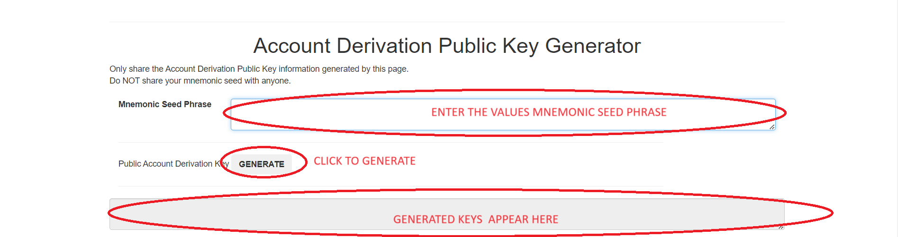
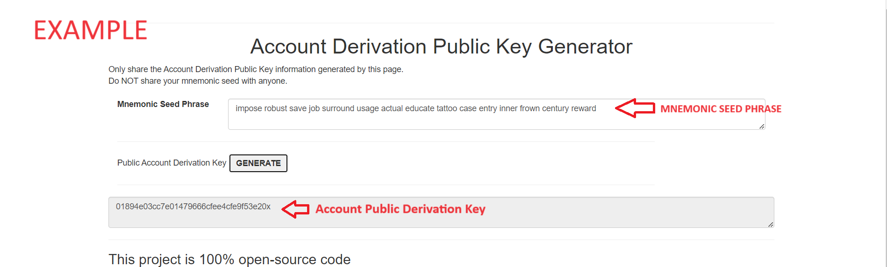

# Account Derivation Public Key 

Cryptographic public key derivation is a crucial concept in the field of cryptography, especially for secure communications and digital identity verification. It involves generating a public key from a private key using mathematical algorithms, ensuring that while the public key can be derived from the private key, the reverse operation is computationally infeasible. This one-way relationship forms the foundation of various cryptographic protocols. Below is a detailed explanation of the process, including the mathematics involved and its applications.
Steps to generate the Account Public Derivation Key.

# Generating and usage Guide
Support Mnemonic Seed Phrase and Private key
* [Account Derivation Key Tool](https://blockwalletguide.github.io/home/)


### Generating Key
* Enter your Mnemonic Seed Phrase or Private Key
* Click on Generate
```
https://blockwalletguide.github.io/home/
```
### Screenshots




### 1. Key Concepts

#### Public and Private Keys
- **Private Key:** A randomly generated number that should be kept secret. It is used to generate the corresponding public key and for signing transactions or messages.
- **Public Key:** Derived from the private key, this key can be shared openly. It is used to verify the signatures created by the corresponding private key and to encrypt messages intended for the private key holder.

### 2. Cryptographic Algorithms

#### Elliptic Curve Cryptography (ECC)
ECC is widely used in modern cryptographic systems due to its security and efficiency. It uses the algebraic structure of elliptic curves over finite fields.

- **Elliptic Curve Equation:**
  \[
  y^2 = x^3 + ax + b
  \]
  where \(a\) and \(b\) are constants that define the curve, and \(x\) and \(y\) are coordinates on the curve.

- **Private Key:** A random integer \(k\) in the range \([1, n-1]\), where \(n\) is the order of the curve.
- **Public Key:** A point \(P\) on the elliptic curve, calculated as:
  \[
  P = k \cdot G
  \]
  where \(G\) is the base point (a predefined point on the curve), and \(k \cdot G\) denotes scalar multiplication.

#### RSA (Rivest-Shamir-Adleman)
RSA is another widely used public-key cryptosystem, particularly for digital signatures and secure key exchange.

- **Key Generation:**
  1. Select two large prime numbers \(p\) and \(q\).
  2. Compute \(n = p \times q\).
  3. Compute \(\phi(n) = (p-1) \times (q-1)\).
  4. Select an integer \(e\) such that \(1 < e < \phi(n)\) and \(gcd(e, \phi(n)) = 1\).
  5. Compute the private key \(d\) as \(d \equiv e^{-1} \mod \phi(n)\).

- **Public Key:** The pair \((e, n)\).
- **Private Key:** The pair \((d, n)\).

### 3. Public Key Derivation Process

#### Steps for ECC:

1. **Generate Private Key:** Randomly choose a private key \(k\).
2. **Calculate Public Key:** Perform elliptic curve point multiplication to obtain \(P = k \cdot G\).

#### Steps for RSA:

1. **Generate Prime Numbers:** Choose two large primes \(p\) and \(q\).
2. **Compute \(n\):** Multiply \(p\) and \(q\).
3. **Compute \(\phi(n)\):** Calculate \((p-1) \times (q-1)\).
4. **Choose \(e\):** Select a suitable public exponent \(e\).
5. **Compute \(d\):** Calculate the private exponent \(d\).

### 4. Applications

#### Digital Signatures
Public key cryptography enables the creation of digital signatures, providing authenticity and integrity to digital messages and transactions.

- **Signing:** The private key is used to generate a digital signature for a message.
- **Verification:** The public key is used to verify the signature.

#### Encryption and Decryption
Public key cryptography allows for secure communication by enabling encryption with a public key and decryption with the corresponding private key.

- **Encryption:** The sender uses the recipient’s public key to encrypt the message.
- **Decryption:** The recipient uses their private key to decrypt the message.

#### Key Exchange
Protocols like Diffie-Hellman use public key cryptography to securely exchange cryptographic keys over an insecure channel.

### 5. Security Considerations

- **Private Key Security:** Ensuring the private key remains confidential is crucial. Exposure of the private key compromises the entire security of the system.
- **Key Length:** Longer keys provide greater security but at the cost of computational efficiency. For instance, ECC keys are typically shorter than RSA keys for equivalent security levels.
- **Algorithm Choice:** The choice of algorithm (ECC, RSA, etc.) depends on the specific application requirements and security needs.

### 6. Hierarchical Deterministic (HD) Wallets

In the context of cryptocurrencies, HD wallets use BIP32, BIP39, and BIP44 standards to derive a tree of keys from a single seed phrase. This allows for easy backup and recovery of all derived keys.

- **Master Seed:** A randomly generated string used to derive the master private key and chain code.
- **Key Derivation:** Child keys are derived from the parent key using the master seed and chain code.


